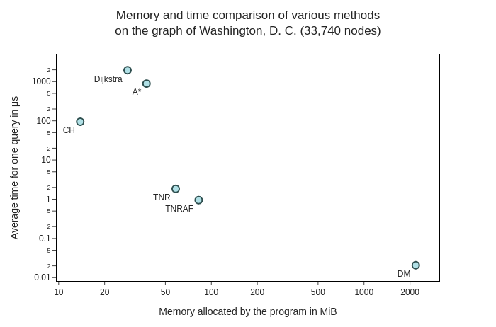
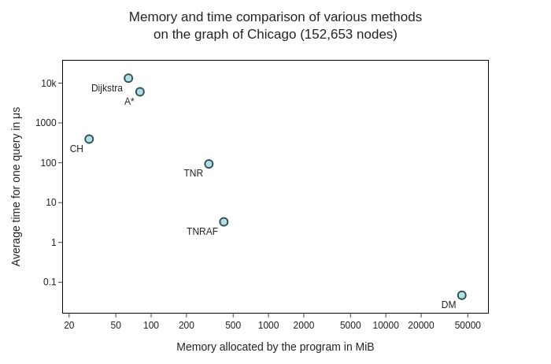

<!-- # Shortest Distances computation library in C++ -->
This project implements multiple methods for shortest distance computation in directed weighted graphs that leverage preprocessing of the graph to provide fast shortest distance queries.
The implemented methods are Contraction Hierarchies, Transit Node Routing (based on Contraction Hierarchies), Transit Node Routing with Arc Flags (extension of Transit Node Routing) and Distance Matrix computation.
Besides that, the API also contains standard algrithms for providing shortest distance queries without preprocessing the graph: Dijkstra and A*.
Below, you can see a comparison of the speed and memory requirements of the implemented methods on two real-world graphs.





The project is split into two major components.
One component is the **preprocessor** (an executable called `shortestPathsPreprocessor`) which takes an arbitrary graph in a supported format (described later) and prepares the graph, creating structures for fast distance computation. Additionally, the preprocessor allows running a set of queries and benchmark the time required to answer them.
This way, the user can easily evaluate whether the performance is sufficient for their use case.

The second component is the **library** (a shared library called `libshortestPaths.so` in Linux or `shortestPaths.dll` in Windows), which can load the structures prepared by the preprocessor to answer shortest distance queries.
The library can be used in a `C++` application, but it can also be integrated into a `Java` application.
A simple example application written in `Java` which uses the library can be found in the `javatests` subdirectory.
This application also serves as a testing tool to check whether the project is working correctly on a given machine.


# Installation

## Prebuilt Packages
The `./prebuilt` directory contains precompiled `shortestPaths` library and
`shortestPathsPreprocessor` executable for Linux and Windows for the x86-64 CPU
architecture.


## From Source

### Requirements

 - [Java](https://java.com/en/download/) (optional, JNI is required for Java bindings)
 - [Doxygen](https://www.doxygen.nl/index.html) for documentation (optional)

#### Required libraries

- boost-config
- boost-graph
- boost-numeric-conversion
- boost-program-options
- p-ranav-csv2
- indicators
- hdf5[cpp]
- proj at least 9.3

### Building the project

1. `mkdir build && cd build`
2. `cmake -DCMAKE_TOOLCHAIN_FILE="<vcpkg dir>/scripts/buildsystems/vcpkg.cmake" -DCMAKE_BUILD_TYPE=Release ..`
3. `cmake --build . --target shortestPathsPreprocessor --config Release`

There are also additional build targets:

- `shortestPaths`: the library
- `doc`: for generating Doxygen documentation (requires Doxygen to be installed)
- `func_test_runner`: for running functional tests

# Usage

## The Preprocessor
The preprocessor has a simple **command line interface**.
Let us now assume that you have a directed weighted graph in one of the supported formats (see [Input/Output File Formats](#inputoutput-file-formats)).
The command line interface requires you to use specific arguments. 
The first argument determines whether you want to preprocess a graph file or benchmark a preprocessed graph using 
some method.
The arguments following the first one are specific to each of the usages.

General usage:
```console
./shortestPathsPreprocessor -m <method name> -f <input format> -i <input path> -o <output path> [--precision-loss <precision loss>] <method specific arguments>
```

where:

- `<input format>` is one of `xengraph`, `dimacs`, `adj`, `csv`
- `<input path>` is path to the input file (including file extension) or folder (for CSV input format)
- `<output path>` is path to the output file (*excluding* file extension - the appropriate extension based will be added automatically)
- `<precision loss>` (optional) is a positive integer denoting how much weight precision to lose. Each loaded weight will be divided by this value before rounding. (default: 1)


### Graph Preprocessing using Contraction Hierarchies
To preprocess a graph using Contraction Hierarchies, call the preprocessor with the the method argument set to `ch`:

Example Usage:
```console
./shortestPathsPreprocessor -m ch -f xengraph -i my_graph.xeng -o my_graph
```

### Graph Preprocessing for Transit Node Routing
To preprocess a graph for Transit Node Routing, call the preprocessor with the method argument set to `tnr`.

Method specific arguments:

- `--tnodes-cnt` is a positive integer that determines the size of the transit nodes (less than or equal to the number of nodes in the graph)
- `int-size` (optional) is integer size to be used in the distance matrix during preprocessing (can be set to 16 or 32, default: native); effective only if `preprocessing-mode` is set to `dm`

Example Usage:
```console
./shortestPathsPreprocessor -m tnr -f xengraph -i my_graph.xeng -o my_graph --preprocessing-mode dm --tnodes-cnt 1000
```


#### Preprocessing Mode
The `--preprocessing-mode` argument determines which of the three available preprocessing modes will be used.
The `fast` mode will precompute the structures in the smallest time out of the three, but the performance of the
resulting data structure will be significantly lower.
The modes `slow` and `dm` will produce exactly the same result, but the `dm` mode uses distance matrix to
speed up the precomputation and therefore, it is faster than the `slow` mode, but it requires a lot of memory.

#### Transit node count
This argument determines the size of the transit nodes set.
It must be an integer between 1 and the number of nodes in the graph.
Less transit nodes usually mean lower memory requirements, but also worse query times.
By choosing the appropriate size of the transit node set, you can find a great balance between memory requirements and performance.


### Graph Preprocessing for Transit Node Routing with Arc Flags
To preprocess a graph for Transit Node Routing with Arc Flags, call the preprocessor with the method argument set to `tnraf`.

Method specific arguments:

- `--preprocessing-mode` is one of `slow`, `dm` (for more info, see [Preprocessing Mode](#preprocessing-mode))
- `--tnodes-cnt` is a positive integer that determines the size of the transit nodes (less than or equal to the numbr of nodes in the graph)
- `--int-size` (optional) is integer size to be used in the distance matrix during preprocessing (can be set to 16 or 32, default: native); effective only if `--preprocessing-mode` is set to `dm`

Example Usage:
```console
./shortestPathsPreprocessor -m tnraf -f xengraph -i my_graph.xeng -o my_graph --preprocessing-mode dm --tnodes-cnt 1000
```

### Generation of Distance Matrix
To generate a distance matrix, call the preprocessor with the method argument set to `dm`.

Method specific arguments:

- `--preprocessing-mode` is one of `slow`, `fast`
- `--output-format` is one of `xdm`, `csv`, `hdf`
- `--int-size` (optional) is integer size to be used in the distance matrix during preprocessing (can be set to 16 or 32, default: native).
Note that this is not the output size (in case of a binary output format), the output integer size is set automatically based on the maximum distance in the graph.

Example Usage:
```console
./shortestPathsPreprocessor -m dm -f csv -i my_graph.csv -o my_graph --preprocessing-mode fast --output-format csv
```

#### Preprocessing Mode
The `fast` mode provides a significant computational speed advantage over the `slow` mode, at an expense of much larger memory usage.


## The Library
The library can be used to load the data structures precomputed by the preprocessor and then answer queries quickly using those structures. 

### Compilation
Compile the library by:

```console
cmake --build . --target shortestPaths --config Release
```

### The Library Interface
The library provides a query manager for each of the three methods (Contraction Hierarchies, Transit Node Routing  and Transit Node Routing with Arc Flags), these query managers serve as an interface that can be used from other applications.
There is no query manager for distance matrix as there is no computation involved, the distance matrix can be used as it is.
The query managers are called `CHDistanceQueryManagerAPI`, `TNRDistanceQueryManagerAPI` and `TNRAFDistanceQueryManagerAPI`.

Each manager provides three functions.
The first function is called `initializeCH` (or `initializeTNR` or `initializeTNRAF` respectively).
This function can load the data structure prepared by the preprocessor along with the mapping file and initialize the query manager for queries.
The second function is `distanceQuery` and it's purpose is to answer queries.
It expects the original IDs of the start and the goal nodes as arguments, then returns the shortest distance from start to goal.
The third function is called `clearStructures`.
It function deallocates all the memory required for the data structure.
This function should be always explicitly called from your application when you will not need to use the query manager anymore.


### Javatests Example and Unit Tests
A simple `Java` application that uses the library to answer queries can be found in the `javatests` subdirectory.
This application was used to test that the API is functional and everything works as intended.
You can however use this application as an example of how to use the library from `Java`.
You can consult the readme for this simple application [here](./javatests/README.md).

Create a `JAVA_HOME` system property with the absolute path to the JDK, e.g., `C:\Program Files\Java\jdk-15.0.1`

For more information about how to integrate this project with other programming languages, please consult the [readme](./src/API/README.md) in the `src/API` subdirectory.


# Testing
The project contains **Functional tests** that tests the correctness of the whole application. Target: `func_test_runner`.


# Benchmarking
The project has a `benchmark` target that can be used to benchmark the performance of the implemented methods. Genneral usage:
```console
./benchmark -m <method> --input-structure <input_data_structure> --query-set <query_set> [--mapping-file <mapping_file>] [-o <output_path>]
```

where:

- `<method>` is one of `dijkstra`, `astar`, `ch`, `tnr`, `tnraf`, `dm` - the method being benchmarked
- `<input_data_structure>` is path to the data structure preprocessed using the preprocessor *for the selected* `method`. For dijkstra and Astar, use the CSV format (path to folder that contains `nodes.csv` and `edges.csv` `input_data_structure` argument.
- `<query_set>` is path to the query set (file format described in the File Formats section below)
- `<mapping_file>` (optional) is path to the mapping file (file format described in the File Formats section below), which will be used to transform node IDs from the query set to the corresponding node IDs used by the query algorithms
- `<output_path>` (optional) is path to the output file for the computed distances

For benchmarking, you will need a set of queries which can either use IDs in the range from 0 to n-1 (where n is the number of the nodes in the graph) or you can use arbitrary integer node IDs.
In the second case, you also need to provide a mapping file (see next section).
The formats of the query set file and the mapping file are described in the
[Input/Output File Formats](#inputoutput-file-formats) section below.

During benchmarking, all of your queries are answered using a chosen method.
Afterwards, the total time need to answer all the queries in seconds is printed alongside the average time needed to answer one query in milliseconds.
Additionally, you can specify an output file, where the computed distances will be stored.
Those distances can then be used for verification of the correctness of the more complex methods.


## A* Benchmarking
Having the [PROJ](https://proj.org) utility installed is required for A* benchmarking. Path to PROJ directory needs to
be provided in an environment variable `PROJ_DATA`, eg. like this:
```console
PROJ_DATA=/usr/share/proj ./shortestPathsPreprocessor benchmark -m astar [options]
```
You can also copy the `proj.db` file into the working directory instead.

## Computed Distances
If you provide the `output_path` argument, the application will output a plain text file that will contain the name of the query set file used for the benchmark on the first line, and then on each following line, the result of each
query.
You can use these files to validate that various methods return the same results.


# Input/Output File Formats
In this part, we will describe all the input formats that can be used with the preprocessor application.
The first three formats are input formats for directed weighted graphs that can be used as input for the creation of
data structures for one of the methods or for the benchmarking of the dijkstra algorithm.
The other two formats are related only to benchmarking.

If you need to get information about output file formats, please look [here](./FORMATS.md) for a description of all file formats used by the library.


## XenGraph Input Format
Probably the simplest format for directed weighted graphs. Graphs are represented as plain text files in this format. 
The graph file looks as follows:

- It begins with a line `XGI n e` where `XGI` is a fixed string which serves as a magic constant. `n` and `e`
are positive integers denoting the number of nodes and edges, respectively.
- After that, exactly `e` lines follow in the format `s t w f`, where each line represents one edge. Here:
	- `s` is the source node of the edge and
	- `t` is the target node of the edge. Both these values must be in the range from 0 to `n`-1 (nodes are indexed from 0).
	- `w` is the weight of the edge, in our case a positive integer and
	- `f` is a flag denoting whether the edge is a one way edge. It must be either 1 or 0. If `f` is equal to 1, the edge is a one way edge and only an edge from `s` to `t` is added to the graph. If `f` is 0, we treat the edge as a bidirectional edge and therefore two edges are added into the graph, an edge from `s` to `t` and an edge from `t` to `s`, both with the weight `w`.

The expected suffix for XenGraph files is `.xeng` although it is not enforced.

### DIMACS input format
This input format was used during the 9th DIMACS Implementation Challenge on shortest paths. The graph file is a plain text file and it looks as follows:

- Lines beginning with the character `c` can occur anywhere in the file. Those lines are comment lines and are skipped during loading.
- First line of the file not starting with the character `c` must be in the format `p sp <nodes> <edges>`, where:
	- `p sp` is a fixed string which serves as a magic constant,
	- `<nodes>` is a positive integer denoting the number of nodes, and
	- `<edges>` is another positive integer denoting the number of edges.
- After that, there must be exactly `e` lines of the format `a s t w`, where each line represents one edge. Here:
	- `a` is a fixed character constant indicating that the line describes one edge (as opposed to `c` representing  a comment line),
	- `s` is the source node of the edge, and
	- `t` is the target node of the edge. In this format, nodes are indexed from 1, so both `s` and `t` must be in the range from 1 to `n` (Internally, 
nodes are indexed from 0, so during loading, each node ID is automatically decremented). In this format, each edge is considered to be a *directional* edge, so if we want a bidirectional edge between `s` and `t`, we must provide two lines, one for an edge from `s` to `t` and one for an edge from `t` to `s`, both with the same weight.

The expected suffix for DIMACS graph files is `.gr` although it is not enforced.

### Adjacency Matrix (ADJ) input format
One of the three input formats that can be used to describe the input graph for the preprocessing.

A CSV file that represents an [adjacency matrix](https://en.wikipedia.org/wiki/Adjacency_matrix) of a graph.

- The file is expected to not have a header.
- The file must have its amount of rows equal to its amount of columns.
- Each value on row `i` and column `j` represents the weight of a *directed* edge from node `i` to node `j`.
- Weights are expected to be valid *positive* integers, or `nan` for where there is no edge joining the nodes.

### CSV input format
A pair of files named `nodes.csv` and `edges.csv` located in the same directory.

- Path to the directory containing these files must be specified in the `input_path` argument.
- `nodes.csv` represents a list of all `n` nodes identified by numbers from 0 to `n`-1 (`id` column) and optionally
(for A* benchmarking) columns `x` (longitude) and `y` (latitude).
- `edges.csv` is a list of edges. The required columns are `u` (source edge identifier), `v` (target edge identifier) and `cost` (edge weight, non-negative integer or floating point number).
- In this format, each edge is considered to be a *directional* edge, so if we want a bidirectional edge between `u`
and `v`, we must provide two lines, one for an edge from `u` to `v` and one for an edge from `v` to `u`, both with the same weight.
- Values must be separated by a Tab character (`\t`).


### The Query Set Input Format
For easier benchmarking, the user can provide a set of queries which will be used for the benchmark in a very simple plain text format:

- The file begins with a line that contains only a single integer `cnt` denoting the number of queries.
- The first line is followed by exactly `cnt` lines in the format `s g` each denoting one query. 
`s` and `g` are both positive integers. 
When benchmarking without mapping, `s` and `g` must be in the range from 0 to `n`-1 where `n` is the number of 
nodes in the graph. 
When benchmarking with mapping, `s` and `g` can be arbitrary positive integers as long as they fit in the long long 
unsigned int datatype (usually 64 bit).

### The mapping file format
If your application internally for some reason uses some node IDs that are not in the range from 0 to `n`-1
(where `n` is the number of nodes in the graph), you can use a mapping file that will allow the application to
transform node IDs from your application to IDs in the range from 0 to `n`-1. 
Using those mapping files, you can let the C++ application do all the mapping work, so will not need to change the
IDs in your application.
The mapping file is a plain text file in the following format:

- The file begins with a line `XID n` where `XID` is a fixed string which serves as a magic constant and `n` is the
amount of nodes in the graph.
- The first line is followed by exactly `n` lines each only containing one integer `i`. The `j`-th line represents
the original ID of the `(j-2)`-th node. So the second line contains the original ID of the node with the ID 0 in our
application.
The third line contains the original ID of the node with the ID 1, and so on up to the line `n+1` contains the
original ID for the node with the ID `n-1` in our application.


# Integration With Other Languages
Integration of this library into an application written in languages other than `C++` and `Java` is also possible,
but it will require you to generate new 'glue code' for the desired language using a tool called `SWIG`. 
You will also need to change the `CMakeLists.txt` file in order to compile the library for such usage. 
The steps required for the integration with a different language are briefly described [here](./src/API/README.md).


# SiMoD
If you want to use the library with SiMoD, you can consult the [Amod readme](./AMOD_README.md) for step-by-step instructions on how to accomplish this.
